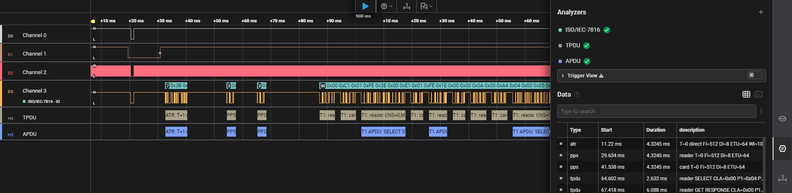

# Saleae ISO/IEC 7816 Analyzer

A custom analyzer for [Saleae Logic](https://www.saleae.com/downloads/) that fully decodes the ISO/IEC 7816-3 smart card protocol from captured waveforms.



Two editions are provided:

| Edition | Target | What it does |
|---------|--------|--------------|
| **Logic 2** (LLA + HLA) | Logic 2 | Low Level Analyzer decodes individual characters; High Level Analyzer reconstructs ATR, PPS, TPDU, and APDU frames |
| **Legacy** | Logic 1.x | Single analyzer, all levels decoded in one pass |

---

## Signals

| Signal | Required | Description |
|--------|----------|-------------|
| IO     | yes | Bidirectional data line (half-duplex) |
| CLK    | yes | Card clock |
| RST    | yes | Reset |
| VCC    | no  | Power rail (optional, used for reference only) |

---

## Logic 2 — Two-layer architecture

Logic 2 uses a two-component pipeline:

```
Captured waveform
       │
       ▼
┌──────────────────────────────┐
│  Low Level Analyzer (C++)    │  one frame per byte
│  • bit sampling & ETU timing │  fields: data, sender
│  • parity check              │
│  • ATR parsing (convention,  │
│    Fi/Di, protocol)          │
│  • PPS parsing               │
└──────────────────────────────┘
       │  char frames
       ▼
┌──────────────────────────────┐
│  High Level Analyzer (Python)│  one frame per protocol unit
│  • ATR summary frame         │
│  • PPS exchange frames       │
│  • T=0 TPDU + APDU frames    │
│  • T=1 block + APDU frames   │
└──────────────────────────────┘
```

### LLA frame fields (Logic 2 data table)

Each byte emitted by the LLA carries:

| Field | Type | Description |
|-------|------|-------------|
| `data` | byte | Raw byte value |
| `sender` | string | `"card"` or `"reader"` (reliable for ATR/PPS; HLA infers direction for T=0/T=1) |

### HLA frame types

| Type | Format | Description |
|------|--------|-------------|
| `atr` | `ATR: <protocol> <convention> Fi=<n> Di=<n> …` | Full ATR (convention, Fi/Di, WI/IFSC/BWI/CWI/EDC) |
| `pps` | `PPS: reader/card T=<n> Fi=<n> Di=<n> ETU=<n>` | One side of PPS exchange |
| `tpdu` | `TPDU: reader <INS> CLA=… P1=… P2=… → <SW>` | Complete T=0 command/response (TPDU mode) |
| `apdu` | `APDU: <INS> <SW>` | Logical APDU (T=0 and T=1) |
| `t1_block` | `T1: reader/card I/R/S block` | Individual T=1 block (TPDU mode only) |
| `t1_apdu` | `T1 APDU: <INS> <SW>` | Reconstructed APDU from I-block chain (APDU mode) |

---

## Installation (Logic 2)

Latest release: **[Lefix2/ISO7816Analyzer/releases](https://github.com/Lefix2/ISO7816Analyzer/releases/latest)**

### Step 1 — Low Level Analyzer

Download [`analyzer_logic2.zip`](https://github.com/Lefix2/ISO7816Analyzer/releases/latest/download/analyzer_logic2.zip) and copy the `.so` / `.dll` for your platform into the Logic 2 custom analyzers directory:

| Platform | Path |
|----------|------|
| Linux    | `~/.config/Logic/plugins/` |
| macOS    | `~/Library/Application Support/Logic/plugins/` |
| Windows  | `%APPDATA%\Logic\plugins\` |

Restart Logic 2, then add the **ISO/IEC-7816** analyzer to your session and assign the IO, CLK, and RST channels.

### Step 2 — High Level Analyzer

#### From Extension Marketplace

Search for ISO/IEC 7816 HLA in Extensions searchbar and install HLA.

#### From local sources

Download [`logic2_hla.zip`](https://github.com/Lefix2/ISO7816Analyzer/releases/latest/download/logic2_hla.zip) and extract `extension.json` and `HighLevelAnalyzer.py` into a dedicated folder (e.g. `ISO7816_HLA/`). In Logic 2:

1. Open **Extensions** → **Load existing extension…**
2. Select the folder containing `extension.json`.
3. Add the **ISO7816 HLA** analyzer to your session and set its input to the **ISO/IEC-7816** LLA.

---

## Installation (Legacy Logic 1.x)

Download [`analyzer_legacy.zip`](https://github.com/Lefix2/ISO7816Analyzer/releases/latest/download/analyzer_legacy.zip) and copy the `.so` / `.dll` into the Logic custom analyzers directory and restart Logic.

---

## Features

### All editions
- **ATR** decoding: TS, T0, TA/TB/TC/TD interface bytes, historical bytes, TCK checksum
- **PPS** (Protocol Parameter Selection) negotiation
- **Direct** and **inverse** convention
- **T=0 TPDU** command/response with INS and SW1/SW2 interpretation
- **T=1 TPDU** block framing (I-block, R-block, S-block) with LRC/CRC EDC
- **APDU** reconstruction from T=0 and T=1 exchanges

### Logic 2 extras
- Logic 2 data table with per-byte `data` and `sender` fields from the LLA
- HLA overlay with ATR/PPS/TPDU/APDU frames above the character stream
- HLA display level setting: **APDU** (one frame per command/response) or **TPDU** (individual T=1 I/R/S blocks)
- Bubble text on the IO channel shows the raw hex value; respects the display base setting (hex / decimal / binary / ASCII)

---

## Build from source

### Prerequisites

- CMake ≥ 3.13
- C++11 compiler (GCC, Clang, or MSVC)
- Git — the Saleae Analyzer SDK is fetched automatically via CMake `FetchContent`

### Logic 2

```bash
cmake -B build -DLOGIC2=ON
cmake --build build
# Output: build/Analyzers/libISO7816Analyzer.so  (Linux/macOS)
#         build/Analyzers/Release/ISO7816Analyzer.dll  (Windows)
```

### Legacy Logic 1.x

```bash
cmake -B build -DLOGIC2=OFF
cmake --build build
```

### Debug build

```bash
cmake -B build -DCMAKE_BUILD_TYPE=Debug -DLOGIC2=ON
cmake --build build
```

---

## Debugging with Logic 2 (Linux/macOS)

```bash
# Find the renderer PID
ps ax | grep Logic.*--type=renderer | head -n1 | cut -d " " -f1

# Verify the analyzer is loaded
lsof -p <PID> | grep libISO7816Analyzer.so

# Attach gdb and set a breakpoint
gdb -p <PID>
(gdb) break ISO7816Analyzer::WorkerThread
```
